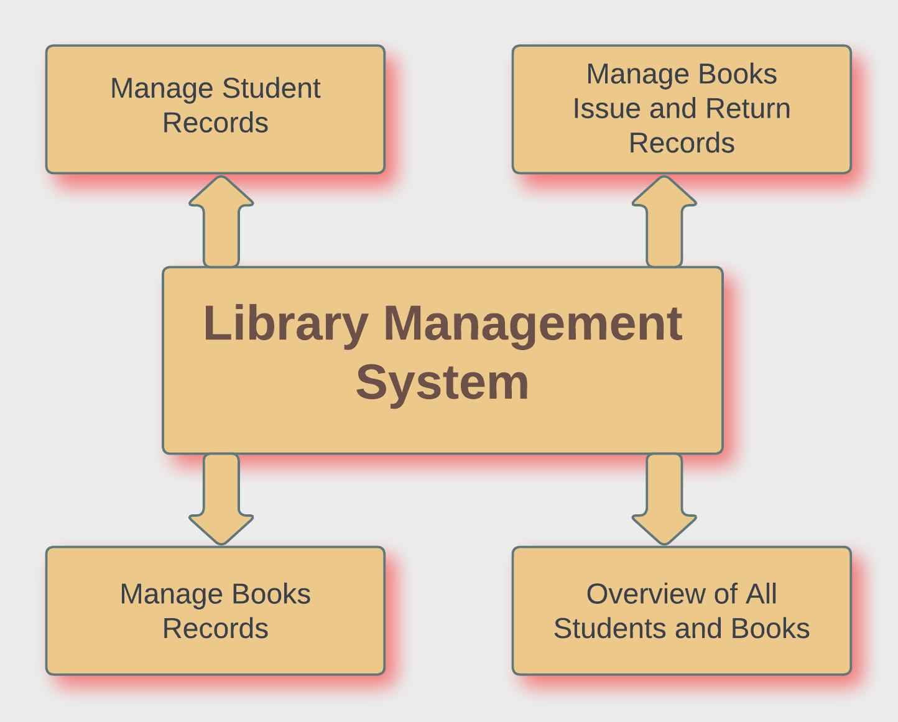
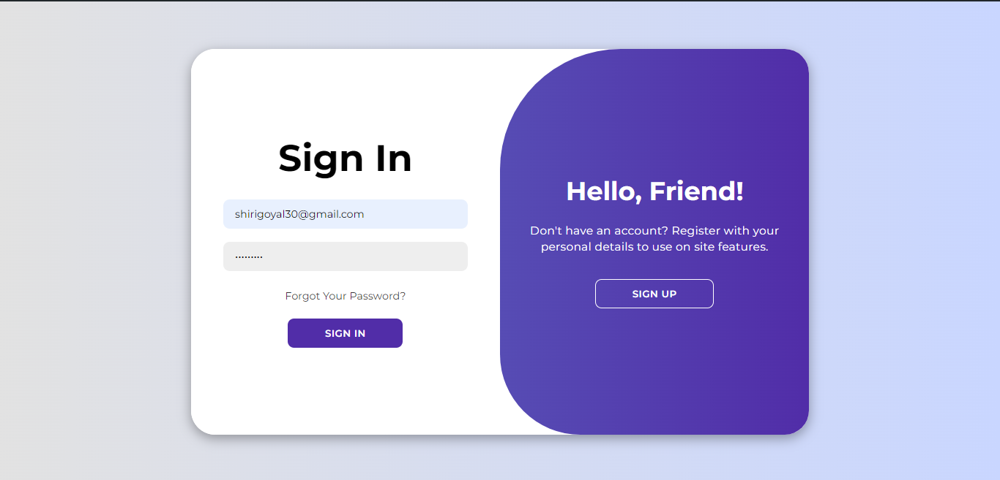
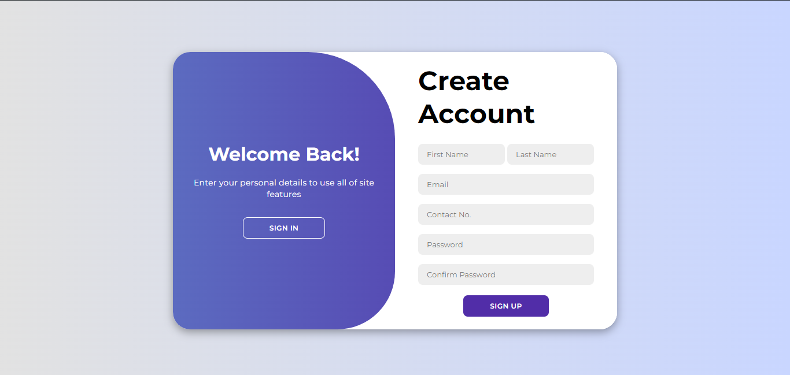
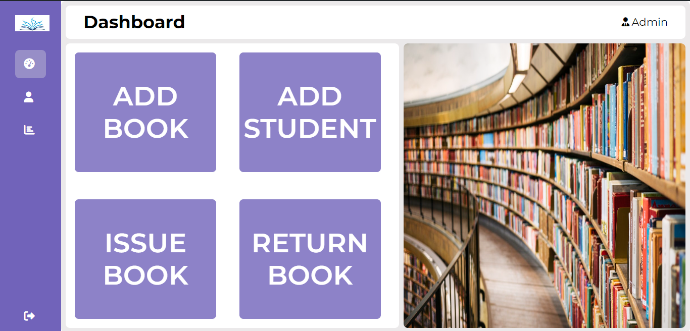
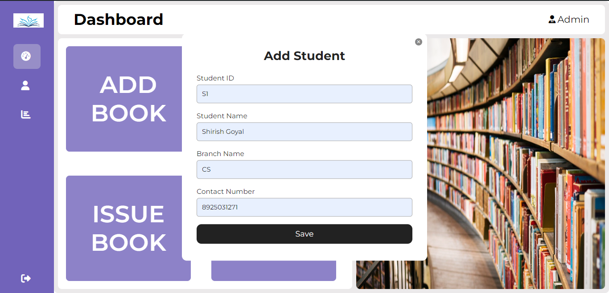
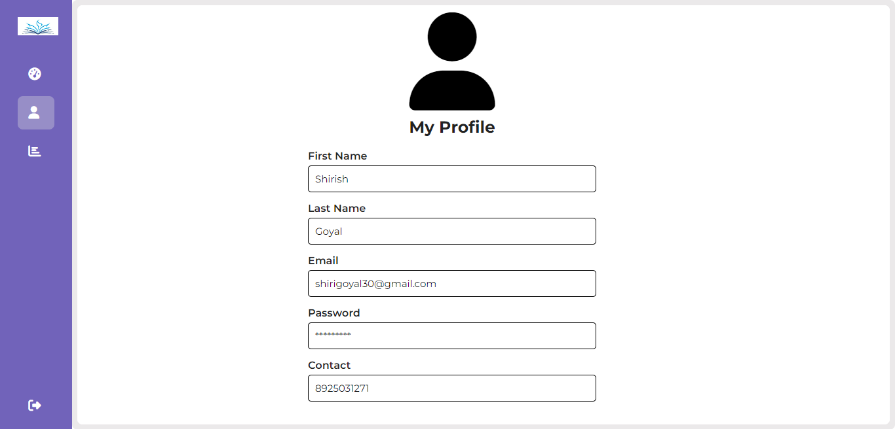
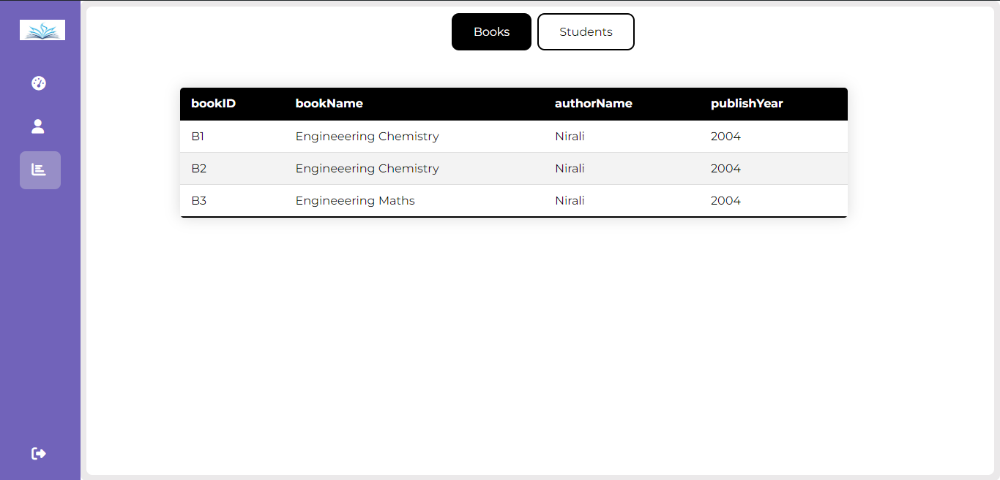
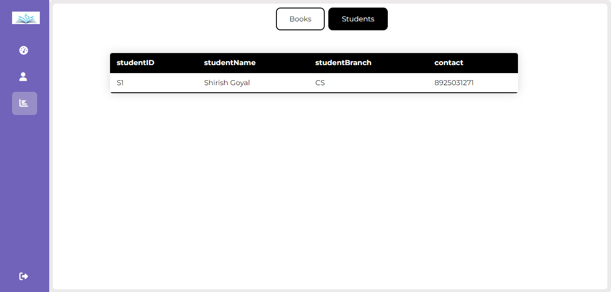
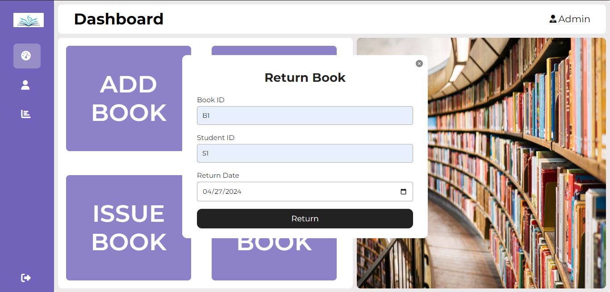

# Library Management System

## Table of Contents
1. [Introduction](#introduction)
2. [Problem Statement](#problem-statement)
3. [Objective](#objective)
4. [Software & Hardware Requirement Specifications](#software--hardware-requirement-specifications)
5. [Implementation](#implementation)
6. [Future Scope](#future-scope)
7. [System Architecture](#architecture)
8. [Screen Shots](#screen-shots)

---

## 1. Introduction 

Libraries serve as essential repositories of knowledge and information, playing a vital role in education and research. However, managing library resources effectively requires efficient organization and administration. To address this need, we developed a library management system aimed at simplifying administrative tasks and enhancing the overall efficiency of library operations.

The purpose of this project is to design and implement a comprehensive system that enables librarians and administrators to manage various aspects of library operations, including the cataloging of books, management of student records, tracking of book issues and returns, and providing insights into library usage patterns.

Utilizing modern web technologies, our system offers a user-friendly interface for administrators to perform key tasks such as adding new students and books to the database, managing circulation records, and generating reports. The frontend of the system is developed using HTML, CSS, and JavaScript, providing a responsive and intuitive interface for users. Meanwhile, the backend is powered by PHP and SQL, ensuring robust data management and integrity.

Throughout this report, we will delve into the system architecture, implementation details, and key features of our library management system. We will also discuss the importance of unique keys in maintaining data integrity and preventing duplicate entries. Additionally, we will outline potential future enhancements to further improve the functionality and usability of the system.

Overall, our library management system aims to streamline administrative workflows, enhance user experience, and ultimately contribute to the efficient operation of libraries in serving their patrons.

## 2. Problem Statement 

- **Manual Administrative Tasks**:
  - Traditional library management involves manual processes for cataloging books, managing student records, and tracking book circulation.
  - These manual tasks are time-consuming and prone to errors, leading to inefficiencies in library operations.

- **Limited Accessibility and Visibility**:
  - Without a centralized system, accessing library resources and tracking their availability becomes challenging for both librarians and students.
  - Lack of visibility into book availability and circulation status hampers effective resource management and utilization.

- **Data Integrity and Duplicate Entries**:
  - In the absence of a robust system, maintaining data integrity becomes challenging, leading to duplicate entries and inconsistencies in records.
  - Duplicate entries can result in confusion and inaccuracies in tracking book circulation and student records.

- **Inefficient Book Circulation Management**:
  - Managing the circulation of books, including issuing and returning, requires manual tracking and record-keeping.
  - Without a streamlined system, tracking overdue books, managing fines, and notifying users about due dates becomes cumbersome.

## 3. Objective 

1. **Automate Administrative Tasks**:
   - Develop a system to automate manual administrative tasks involved in managing library resources, such as cataloging books and managing student records.

2. **Improve Accessibility and Visibility**:
   - Create a centralized platform that allows librarians and students to easily access and track library resources, including book availability and circulation status.

3. **Ensure Data Integrity**:
   - Implement mechanisms to ensure data integrity and prevent duplicate entries in the library database, maintaining accurate records of book circulation and student information.

4. **Streamline Book Circulation Management**:
   - Develop features for efficiently managing the circulation of books, including issuing, returning, tracking overdue books, managing fines, and sending notifications to users.

5. **Provide Insights and Reporting**:
   - Enable librarians to gain insights into library usage patterns, popular titles, and circulation trends through comprehensive reports and analytics.

6. **Facilitate Future Scalability and Development**:
   - Build the system with scalability in mind, allowing for future enhancements and expansion of features to meet evolving needs and requirements.

## 4. Software & Hardware Requirement Specifications 

- **Software Requirements**:
  - HTML
  - JavaScript
  - CSS
  - MySQL
  - PHP

- **Hardware Requirements**:
  - Processor: Intel core i5 or more
  - RAM: 4 GB or more
  - Hard disk: 40 GB hard disk recommended

## 5. Implementation 

The implementation of the library management system involved several stages, including system design, frontend and backend development, database setup, and testing. Below is an overview of the implementation process:

1. **System Design**:
   - The project commenced with a thorough analysis of requirements to determine the system architecture and design.
   - The design phase involved creating wireframes, defining user flows, and outlining the functionalities of the system.

2. **Frontend Development**:
   - The frontend of the system was developed using HTML, CSS, and JavaScript to create a responsive and user-friendly interface.
   - The user interface design focused on simplicity and intuitiveness, ensuring ease of navigation for administrators and users.

3. **Backend Development**:
   - The backend of the system was built using PHP to handle server-side logic and process requests from the frontend.
   - PHP scripts were responsible for interacting with the database, executing CRUD (Create, Read, Update, Delete) operations, and handling user authentication and authorization.

4. **Database Setup**:
   - MySQL was chosen as the relational database management system for storing and managing library data.
   - The database schema was designed to accommodate various entities such as books, students, circulation records, and user accounts.

5. **Integration and Testing**:
   - Once the frontend and backend components were developed, integration testing was performed to ensure seamless communication between the two.
   - Testing involved validating user inputs, verifying data integrity, and conducting end-to-end tests to identify and address any bugs or issues.

## 6. Future Scope 

1. **Student Integration**: Incorporate features tailored to students' needs, such as user profiles and collaborative tools.
2. **Mobile App**: Develop a mobile application for on-the-go access to library resources.
3. **LMS Integration**: Integrate with learning management systems to seamlessly access library materials within coursework.
4. **Advanced Search**: Implement advanced search and recommendation systems for better resource discovery.
5. **Accessibility**: Ensure accessibility features for all users, including those with disabilities.
6. **Data Analytics**: Utilize data analytics for insights into library usage patterns and user behavior.
7. **Continuous Improvement**: Adopt an iterative approach, gathering user feedback for ongoing enhancements.

## 7. System Architecture 
  
  
## 8. Screenshots 

1. **Admin Login Page**
   
   
2. **Admin SignIn Page**
   
   
3. **Dashboard**
   
   
4. **Add Book**
   

5. **Add Student**
   

6. **Profile**
    

7. **View Book**
   

8. **View Student**
   

9. **Issue Book**
   

10. **Return Book**
   
---
